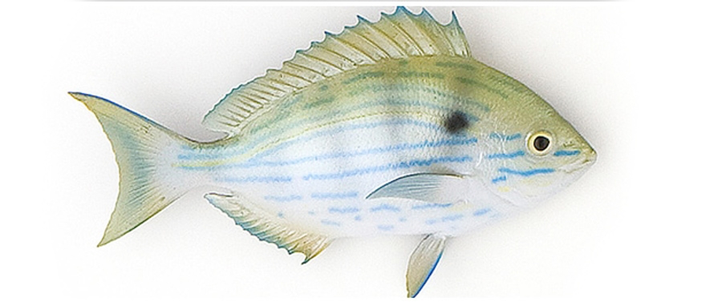
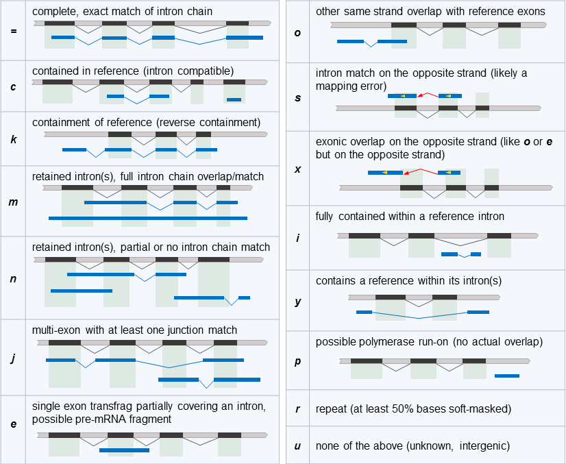

<div style="position:absolute;top:0px;right:0px;padding:20px;background-color:white;width:25%;">
```{r, echo=FALSE}

```
</div>


```{r setup, include=FALSE}
# call with:
# R --slave -e 'rmarkdown::render("Nanopore_Pinfish_Analysis.Rmd", "html_document")'

knitr::opts_chunk$set(tidy = FALSE, cache.extra = packageVersion('tufte'))
options(htmltools.dir.version = FALSE)
knitr::opts_chunk$set(fig.width=9, fig.height=6, warning=FALSE, message=FALSE)

library(readr)
library(digest)
library(ggplot2)
library(knitr)
library(RColorBrewer)
library(tufte)
library(yaml)
library(ShortRead)   # oh the irony!
library(kableExtra) 
library(pdftools)
library(data.table)
library(stringr)
library(gridExtra)
library(dplyr)
library(InterMineR)

config <- yaml.load_file("config.yaml")
tutorialText <- config$tutorialText

# how many genes for enrichment (from config.yaml)
topexp=config$topexp

##
# the readFastq method from ShortRead does not handle bzip files very well - let´s use the 
# uncompressed file that has already been unpacked within the required Snakefile
rawData <- file.path(getwd(), "RawData", gsub("(\\.gz$)|(\\.bz2$)", "",config$raw_fastq))

pycData <- file.path(getwd(), "Analysis", "Pychopper", 
                     paste(gsub("(\\.gz$)|(\\.bz2$)", "", config$raw_fastq), "pychop.fastq", sep="."))
```

```{r cust.functions, echo=FALSE}
slurpContent <- function(filename) {
  include = as.logical(config$UserText)
  if (include) {
    paste(readLines(filename),collapse="\n")
  }
}

ncalc <- function(len.vector, n) {
  # N50 - length such that scaffolds of this length or longer include half the bases of the assembly
  len.sorted <- rev(sort(len.vector))
  len.sorted[cumsum(as.numeric(len.sorted)) >= sum(len.sorted)*n][1]
}


lcalc <- function(len.vector, n) {
  len.sorted <- rev(sort(len.vector))
  which(cumsum(as.numeric(len.sorted)) >= sum(len.sorted)*n)[1]
}


processQCFastq <- function(file) {
  fastq <- readFastq(file)
  c(
    reads = formatC(length(fastq), big.mark=","),
    mbs = formatC(round(sum(width(fastq)) / 1000 / 1000, digits=1), big.mark=","),
    min = min(width(fastq)),
    max = max(width(fastq)),
    mean = round(mean(width(fastq)), digits=1),
    median = round(median(width(fastq)), digits=0),
    qval = round(mean(alphabetScore(fastq) / width(fastq)), digits=1),
    gc = round(mean(letterFrequency(sread(fastq), "GC")  / width(fastq)) * 100, digits=1),
    n50 = ncalc(width(fastq), n=0.5),
    l50 = lcalc(width(fastq), n=0.5),
    n90 = ncalc(width(fastq), n=0.9),
    l90 = lcalc(width(fastq), n=0.9)
  )
}

# https://stackoverflow.com/questions/6461209/how-to-round-up-to-the-nearest-10-or-100-or-x
roundUpNice <- function(x, nice=seq(from=1, to=10, by=0.25)) {
    if(length(x) != 1) stop("'x' must be of length 1")
    10^floor(log10(x)) * nice[[which(x <= 10^floor(log10(x)) * nice)[[1]]]]
}
```

```{r startingData, echo=FALSE}

data <- lapply(c(rawData, pycData), processQCFastq)
qcData <- data.frame(data)
colnames(qcData) <- c("RawData", "Pychopper")

```

`r slurpContent("Preamble.md")`


# GridION Transcriptome data processing workflow

Best quality read data was produced by re-basecalling the raw ONT data with Guppy (version `r config$guppy_version`) in high accuracy calling mode (hac).

The **'Pinfish analysis pipeline'** selects reads which have both primer sequences expected from the library prep and cuts the found fragments out to produce a high quality data subset using **'Pychopper'** (https://github.com/nanoporetech/pychopper).

All selected reads are aligned to the reference genome with **'minimap2'** [@minimap22018] to find the corresponding loci. The obtained mapping data is then used to cluster different gene regions and obtain spliced variants with documented exon usage. The clusters are corrected using the long read mapping data and **'racon'** [@racon2017] then classified against the reference transcriptome models and statistics are returned to report expected and novel entities [@R-ShortRead].

The table below reports the counts of the different entities found with the sequencing dataset.


```{r summaryStatsTable, echo=FALSE, cache=FALSE, resize.width=100}

knitr::kable(qcData, caption="Summary statistics for the cDNA data processed before and after PyChopper filtering", booktabs=TRUE, table.envir='table*', linesep="")  %>%
  kable_styling(latex_options=c("hold_position", font_size=9)) 
```

The summary statistics displayed in the table above include observational metrics including the number of reads, information on the longest, shortest and mean sequence read lengths and other information that includes GC content, N50 and N90 read lengths. The first result column describes the sequence characteristics of the raw sequence collection. The second column describes the sequences following the **`pychopper`** analysis.

**`pychopper`** selects for sequence reads that contain the appropriate adapter sequences at each end of the sequence read. These adapter sequences are also used to orientate the sequences into the correct stranded orientation. 
Running **`pychopper`** on your sequence collection will reduce the total number of reads but will qualitatively increase the utility of the library for isoform discovery. The table above should be reviewed to see how the starting sequence library has been transformed.


```{r, echo=FALSE, fig.width=5, fig.height=4}

# inputs
pycStats <- file.path(getwd(), "Analysis", "Pychopper", 
                     paste(gsub("(\\.gz$)|(\\.bz2$)", "", config$raw_fastq), "pychop.stats", sep="."))
pycStats <- data.table::fread(pycStats)
mstats <- melt(as.matrix(c(classified=as.numeric(pycStats[1,"+"] + pycStats[1,"-"]),
                           unclassified=as.numeric(pycStats[1,"unclassified"]))))
# geom_histogram(stat="identity", fill="steelblue") + 
ggplot(mstats, aes(Var1, value)) + 
  geom_col(fill="steelblue") +
  labs(title="Pychopper cDNA read classification") + 
  xlab("Pychopper full length classification") +
  ylab("Count (reads)")

```

The figure above shows a the distribution of reads that have been called as either full length (classified) or not being full length (unclassified). If too many reads have been removed this could be an indication of problems during library preparation (wrong choice of the primer sequences given to Pychopper or technical issue during library prep).

```{r, echo=FALSE, fig.width=5, fig.height=4}

ggplot(melt(as.matrix(pycStats[,c(1,2)])), aes(Var2, value)) + 
  geom_col(fill="steelblue") + 
  labs(title="Pychopper cDNA orientation") + 
  xlab("Pychopper called sequence strand") + 
  ylab("Count (reads)")
```

The figure above shows the distribution of Pychopper classifications for sequence reads oriented in the (+) or (-) direction.

```{r lengthdistribution, include=TRUE, cache=FALSE, echo=FALSE}

# load raw reads
fastq <- readFastq(rawData)

# collect metrics for all reads
sequenceSet <- as.data.frame(cbind(as.character(ShortRead::id(fastq)), 
                                   width(fastq), 
                                   alphabetScore(fastq)/width(fastq) ,
                                   "Raw"), 
                             stringsAsFactors=FALSE)
colnames(sequenceSet) <- c("seqId", "length", "quality", "set")

# collect metrics from PyChopper reads
pycIds <- gsub(" strand=.", "", as.character(ShortRead::id(readFastq(pycData))))
sequenceSet[which(sequenceSet$seqId %in% pycIds), "set"] <- "PyChopper"
sequenceSet$length <- as.numeric(sequenceSet$length)
sequenceSet$quality <- as.numeric(sequenceSet$quality)

# build histogram with 40 bins
upperLimit <- roundUpNice(as.numeric(quantile(x=sequenceSet$length, probs=c(0.995))))
histogramBinCount <- 40
breakVal = roundUpNice(upperLimit / histogramBinCount)
breaks <- seq(0, to=upperLimit, by=breakVal)

rawS <- table(cut(subset(sequenceSet, set=="Raw")$length, breaks, include.lowest=TRUE, right=FALSE))
pycS <- table(cut(subset(sequenceSet, set=="PyChopper")$length, breaks, include.lowest=TRUE, right=FALSE))

lengthDist <- data.frame(length=head(breaks, -1), raw=as.vector(rawS), pychop=as.vector(pycS))

lengthDistMelt <- reshape2::melt(lengthDist, id.vars=c("length"))

# plot read length distribution for rax and PyChopper reads
ggplot(lengthDistMelt, aes(x=length, fill=variable, y=value)) +
  geom_col() +
  xlab("Read length\n") + ylab("Number of reads\n") +
  scale_fill_manual("Read QC", values=c("raw"=brewer.pal(6, "Paired")[1], "pychop"=brewer.pal(6, "Paired")[2])) +
  scale_x_continuous(limits=c(-breakVal,upperLimit), breaks=pretty(sequenceSet$length,n=40)) +
  labs(title="Histogram showing distribution of read lengths before and after PyChopper filtering", fill="filter")

```

The figure above shows a histogram of the sequence read length distribution before and after the **`pychopper`** analysis. A global concordance is observed with reduction of longest reads cleaved by Pychopper at the level of the second primer (potential chimera during the run)


# Pinfish clustering and polishing

The **`pinfish analysis pipeline`** is run by the **`snakemake`** workflow management software and the results from the analysis are stored in the folder: `Analysis/Pinfish/`

The **`pinfish`** workflow is described fully at its [github page](https://github.com/nanoporetech/pinfish) and at the [pipeline-pinfish-analysis page](https://github.com/nanoporetech/pipeline-pinfish-analysis). The working folder contains a number of intermediate files; the key result files include:

* **`polished_transcripts_collapsed.gff`** is a gff format annotation file that describes the gene transcripts identified following clustering, sequence correction and transcript collapse within the **`pinfish`** workflow
* **`corrected_transcriptome_polished_collapsed.fas`** is a fasta format sequence file that provides the DNA sequence for the identified transcripts. This is based on the **`gff`** annotations calculated and the reference genome provided. These fasta sequences are produced using the **`gffread`** software 


# Exon size & read depth from the clustered data

The clustered & collapsed results were parsed from the file 'clustered_transcripts_collapsed.gff' and the data used to produce the feature abundance vs size scatter plot below.

```{r, echo=FALSE}
# read clustered data in
cc.gff <- file.path(getwd(), "Analysis", "Pinfish", "clustered_transcripts_collapsed.gff")
cluster.collapsed <- read.delim(cc.gff, header=F, comment.char="#")
colnames(cluster.collapsed) <- c("chr", "source", "feature.type", "start", "end", "depth", "strand", "nul", "id")
cluster.collapsed$featlen <- cluster.collapsed$end - cluster.collapsed$start

# plot with marginal histograms
g <- ggplot(cluster.collapsed, aes(x=featlen, y=depth, colour=factor(feature.type))) +
  geom_point(size=2, alpha=0.1) +
  scale_x_log10() +
  scale_y_log10() +
  xlab("feature size (log)") +
  ylab("read coverage (log)") +
  theme_classic() +
  theme(
    panel.background = element_rect(fill = "transparent", colour = NA),
    plot.background = element_rect(fill = "transparent", colour = NA),
    legend.background = element_rect(fill = "transparent", colour = NA),
    legend.box.background = element_rect(fill = "transparent", colour = NA),
    legend.title = element_blank()
  )
g2 <- ggExtra::ggMarginal(g, 
                          type = 'density',
                          margins = 'both',
                          size = 2,
                          colour = '#2B00FF',
                          fill = '#FFA500')
plot(g2)
```

# Expressed genes and expression levels from the raw data

Based on the Full BAM data and the genome coordinate of all exons (current reference genome: **'config$genome_id'**), we computed how many of the reference exons had coverage and counted the corresponding genes (keeping the average exon coverage as final coverage value). In this section, we made use of the tool **'mosdepth'** (https://github.com/brentp/mosdepth) and some R magic.

```{bash echo=FALSE, eval=FALSE, comment=""}
# Part now done by Snakemake
# create BED track for exons with gene ID as name
#grep -v "^#" Saccharomyces_cerevisiae.R64-1-1.97.gff3 | gawk 'BEGIN{FS="\t"; OFS="\t"}{if ($3=="exon") {split($9,id, ";"); gsub("Parent=transcript:","",id[1]); gsub("_mRNA","",id[1]); print $1,$4-1,$5,id[1],$7}}' \
#| sort -k 1V,1,-k 2n,2 -k 3n,3 > Saccharomyces_cerevisiae.R64-1-1.97_exons.bed

# same from gtf
#grep -v "^#" ../reference/Saccharomyces_cerevisiae.R64-1-1.97.gtf | gawk 'BEGIN{FS="\t"; OFS="\t"}{if ($3=="exon") {split($9,id, #";"); gsub("gene_id \"","",id[1]); gsub("\"","",id[1]); print $1,$4-1,$5,id[1],$7}}' \
#| sort -k 1V,1 -k 2n,2 -k 3n,3 > ReferenceData/Saccharomyces_cerevisiae.R64-1-1.97_exons.bed

# run mosdepth
#mkdir -p Analysis/MosDepth
#mosdepth -t 80 \
#  -b ReferenceData/Saccharomyces_cerevisiae.R64-1-1.97_exons.bed \
#  Analysis/MosDepth/gt0 \
#  Analysis/Minimap2/3166_20190730_hac.fq.bam
```


```{r MosDepth analysis, echo=FALSE, comment=""}
# import results for R
cov <- read_delim("Analysis/MosDepth/gt0.regions.bed.gz", 
    "\t", escape_double = FALSE, col_names = FALSE, 
    trim_ws = TRUE)
colnames(cov) <- c("chr", "start", "end", "gene", "cvg")

# merge by gene and store avg-cvg across exons
cvg.dat <- as_tibble(cov)
cvg.dat <- cvg.dat %>% 
  group_by(gene) %>%
  dplyr::summarize(chr = unique(chr),
                   from = min(start),
                   to = max(end),
                   avg_cvg = mean(cvg, na.rm=TRUE)) %>%
  arrange(chr,from,to)

exp <- subset(cvg.dat, cvg.dat$avg_cvg>=0)
suppressMessages(
  ggplot(exp, aes(x=avg_cvg)) + 
  geom_density(alpha=.3) +
  xlim(c(0,500)) +
    xlab("per-gene average read coverage") +
    ylab("fraction of genes at a given read coverage")
)
```

REM: the plot was truncated at 500 to hide the very long tail of highly expressed genes

The full distribution of expressed genes is shown next with the cumulative sum of the read coverage across all `r nrow(cvg.dat)` genes ordered from the least to the most expressed

```{r MosDepth IGV track, echo=FALSE, comment=""}
# add cumsum
tot <- sum(cvg.dat$avg_cvg)
max <- max(cvg.dat$avg_cvg)

cvg.dat2 <- cvg.dat %>% 
  arrange(avg_cvg) %>%
  dplyr::mutate(rank = row_number()) %>%
  dplyr::mutate(cumsum = cumsum(avg_cvg)) %>%
  dplyr::mutate(perc_reads = cumsum/tot) %>%
  dplyr::mutate(read_fraction = sprintf("%1.2f%%", 100*avg_cvg/tot))

top90pc <- nrow(cvg.dat2) - min(which(cvg.dat2$perc_reads>=0.10))
top50pc <- nrow(cvg.dat2) - min(which(cvg.dat2$perc_reads>=0.50))
top25pc <- nrow(cvg.dat2) - min(which(cvg.dat2$perc_reads>=0.75))
top10pc <- nrow(cvg.dat2) - min(which(cvg.dat2$perc_reads>=0.90))

N50 <- nrow(cvg.dat2)-top50pc
N90 <- nrow(cvg.dat2)-top90pc

ggplot(data=cvg.dat2, aes(x=rank, y=perc_reads)) +
  geom_line() +
  xlab("gene rank sorted by increasing coverage") +
  ylab("fraction of all mapped reads") +
  geom_vline(xintercept=N50, colour="red", linetype = "longdash") +
  geom_vline(xintercept=N90, colour="red", linetype = "dotted")

# create IGV coverage track 
igv <- cvg.dat2[,c(2:4,1,5)] %>%
  arrange(chr, from, to)

cat("#track name=average-coverage graphType=bar autoscale=on scaleType=Log windowingFunction=none \n", file="Analysis/MosDepth/gene_coverage.igv")
write.table(igv, file="Analysis/MosDepth/gene_coverage.igv", append=TRUE, quote = FALSE, sep="\t", col.names=FALSE, row.names=FALSE)
```

REM: the dotted line divides the coverage data in 10% for the left genes and 90% for the right genes while the dashed line shows the N50 (as many reads mapping to both sides).

The top N genes (from the right of the plot) contribute to X% of all reads

* `r top90pc` most expressed genes => 90% of the reads
* `r top50pc` most expressed genes => 50% of the reads
* `r top25pc` most expressed genes => 25% of the reads
* `r top10pc` most expressed genes => 10% of the reads

The next table reports the top`r topexp` most expressed genes based on coverage values (right of the curve).

```{r, echo=FALSE, cache=FALSE, resize.width=100}

knitr::kable(tail(cvg.dat2,topexp)[,c(1:5,9)], caption=paste("Top ", topexp, " expressed genes", sep=""), booktabs=TRUE, table.envir='table*', linesep="")  %>%
  kable_styling(latex_options=c("hold_position", font_size=9)) 
```

# Functional enrichment results from the Top`r topexp` expressed genes

The biological functions carried by the top `r topexp` expressed genes were identified using '''`r config$mine`''' as part of the '''InterMine''' suite [@InterMine] (http://intermine.org/).

```{r InterMine analysis, echo=FALSE, cache=FALSE, resize.width=100}
# prepare InterMine sources
mine <- config$mine
im <- initInterMine(mine=listMines()[mine])
#template = getTemplates(im)
#template[grep("gene", template$name, ignore.case=TRUE),]
#queryGeneGO <- getTemplateQuery(im, "Gene_GO")
#queryGeneGO
#queryGenePathway <- getTemplateQuery(im, "Pathway_Genes")
#queryGenePathway
#widgets = as.data.frame(getWidgets(im))
#widgets

# load the correct genome database for InterMineR
enrichlib <- config$orgdb
library(enrichlib,character.only = TRUE)

# create ENTREZ mapping database dynamically based on the chosen enrichlib
miner.ENTREZ <- paste(gsub(".db", "", enrichlib), "ENTREZID", sep="")
x <- eval(parse(text=miner.ENTREZ))

# Get the SGD gene IDs that are mapped to an Ensembl ID
mapped_genes <- mappedkeys(x)
# Convert to a list
xx <- as.list(x[mapped_genes])

# prepare gene-list for enrichment
# extract gene IDs to vector
ids <- tail(cvg.dat2, topexp)[,1]$gene

# convert to entrez
entrez <- xx[ids]

# remove NA's
entrez[sapply(entrez, is.null)] <- NA

# get corresponding EntrezIDs
dat <- data.frame(query=ids, entrezID = as.vector(unlist(entrez)))

# remove NA's
dat <- subset(dat,dat$entrezID != "NA")

# convert to vector
gene_entrez <- as.character(unlist(dat$entrezID))

## enrich against interMine

# get GO enrichment
GO_FDR_enrichResult = doEnrichment(
  im = im,
  ids = gene_entrez,
  widget = "go_enrichment_for_gene",
  correction = "Benjamini Hochberg"
)

# get Pathway enrichment
Path_FDR_enrichResult <- doEnrichment(
  im = im,
  ids = gene_entrez,
  widget = "pathway_enrichment",
  correction = "Benjamini Hochberg"
)

```

```{r InterMine enrichment results, echo=FALSE, cache=FALSE, resize.width=100}
knitr::kable(GO_FDR_enrichResult$data[1:10,], 
             caption=paste("Top10 Miner-enriched GO categoried for the Top", topexp," genes", sep=""), 
             booktabs=TRUE, 
             table.envir='table*', 
             linesep="")  %>%
  kable_styling(latex_options=c("hold_position", font_size=9)) 
```

```{r InterMine enrichment results-2, echo=FALSE, cache=FALSE, resize.width=100}
knitr::kable(Path_FDR_enrichResult$data, 
             caption=paste("Miner-enriched pathways for the Top", topexp," genes", sep=""), 
             booktabs=TRUE, 
             table.envir='table*', 
             linesep="")  %>%
  kable_styling(latex_options=c("hold_position", font_size=9)) 
```

REM: The results above are hopefully representative of the culture medium and growth conditions applied to that sample. Better enrichment results would be obtained for differential expression betwen two conditions which we do not have here for that single sample.

# Transcript Isoform concordance with the public annotations

The [GffCompare](https://github.com/gpertea/GffCompare) methods provide a collection of tools that can be used to look for overlapping and novel features within and between genome annotation **`GFF`** files. The cluster and polished transcript annotations from **`pinfish`** are compared to the reference genome annotation. Each provided transcript is analysed to define if it novel (absent from the reference database), identical to a known transcript or similar to a known transcript..

**`GffCompare`** is run during the **`Snakemake`** process [@snakemake2012]. The method is run using the specified GFF genome annotation provided in the config file (``` `r  gsub("(\\.gz$)|(\\.bz2$)", "", gsub(".+/","", config$genome_annot))` ```) and with the following configuration parameters 

* **`-r`**  specifies reference genome
* **`-R`**  causes GffCompare to ignore reference transcripts that are not overlapped by any transcript in input GFF
* **`-M`**  discard (ignore) single-exon transfrags and reference transcripts
* **`-C`**  Discard the “contained” transfrags from the .combined.gtf output. By default, without this option, GffCompare writes in that file isoforms that were found to be fully contained/covered (with the same compatible intron structure)
* **`-K`**  do NOT discard any redundant transfrag matching a reference


```{r, echo=FALSE, comment=""}
cat(paste(readLines("Analysis/GffCompare/nanopore.stats"),collapse="\n"))
```

The output above is from the **`GffCompare`** summary statistics. This describes the number of transcripts that were identified within the **`Pinfish`** analysis that are non-redundant and are overlapping with the provided reference annotation. Sensitivity and precision of annotation are compared with the reference. This output also provides information on the novelty of transcribed features. The formulae below describe the calculations for sensitivity and precision using true positives (TP), false positives (FP), true negatives (TN) and false negatives (FN).


Sensitivity = $TP/(TP+FN)$

Precision = $TP/(TP+FP)$

Values from the summary above were fed to the wub script 'plot_gffcmp_stats.py' to produce a plot shown next.

```{r, echo=FALSE}
knitr::include_graphics("Analysis/Pinfish/plot_gffcmp_stats.png")

```

The analysis here only considers the reference genes that are partially or completely covered by **`Pinfish`** transcripts. The sensitivity will be determined by the number of starting cDNA sequence reads and the diversity of gene expression that was represented within the starting cDNA collection.

The **`GffCompare`** software classifies transcripts within its output files into classes that include ("=", "u", "c") and others. These define how a transcript can be best described relative to the provided reference annotation.



The figure above is from the **`GffCompare`** software webpages at John Hopkins University. This figure describes the different codes and provides cartoons illustrating the differences with canonical genes.

Summary statistics for the isoforms contrasted to the reference annotation are provided in the **`GffCompare/nanopore.tracking`** results file. These **`GffCompare`** codes can be plotted as a histogram.

```{r, echo=FALSE}

tracking <- data.table::fread("Analysis/GffCompare/nanopore.tracking", stringsAsFactors=FALSE, sep="\t", header=FALSE)
ggplot(tracking, aes(V4)) + 
  geom_bar(fill="steelblue") + 
  labs(title="histogram showing GffCompare classes for annotated transcripts") + 
  xlab("GffCompare class")

```

The histogram in the figure above shows the distribution of **`GffCompare`** annotated transcripts. There are **`r length(which(tracking$V4 == "="))`**  transcripts assigned code **`=`** or corresponding to an exact match with an annotated gene. **`r length(which(tracking$V4 == "u"))`** transcripts are undefined in the provided genome annotation GFF file. These transcripts could represent novel genes. The other codes together account for **`r round((nrow(tracking) - length(which(tracking$V4 == "=" | tracking$V4 == "u"))) / nrow(tracking) * 100, digits=1)`** **%** of the sequence reads and represent potentially novel isoforms with a variety of missing exons, retained introns and more complex multi-exon events. 

GffCompare finally collapses transcribed-fragments (transfrags) into the single longest transcript that shares the same patterns of intron boundaries to produce a non-redundant set of transcripts. 

```{r, comment=NA, echo=FALSE}

printGFFclass <- function(usegffclass) {
  gffclasssel <- t(data.frame(strsplit(gsub("^[^:]+:","",unlist(tracking[which(tracking$V4 == usegffclass),5])),"\\|")))
  
  gff <- data.table::fread("Analysis/GffCompare/nanopore.combined.gtf")
  gffTranscripts <- which(gff$V3=="transcript")
  gffTranscripts <- as.data.frame(cbind(gffTranscripts,gsub("\\|.+","",gsub(".+oId \"","",unlist(gff[gffTranscripts,9])))), stringsAsFactors=FALSE)
  gffTranscripts[,1] <- as.numeric(gffTranscripts[,1])
  
  gffCoords <- gff[gffTranscripts[match(gffclasssel[,2],  gffTranscripts[,2]),1],]
  gffCoords$interval <- gffCoords[,5] - gffCoords[,4]
  gtype <- gff$V3
  
  gffCoords$exoncount <- gffclasssel[,4]
  # concordant in test sets
  
  gffCoords <- data.frame(gffCoords)[,c(1,2,3,4,5,7,10,11)]
  colnames(gffCoords) <- c("Chr", "Pipeline", "Feature", "Start", "Stop", "Strand", "Interval", "Exons")
  
  # we can have NA values in this table since the tracking data is based on a redundant dataset and the gff is nonred
  if (length(which(is.na(gffCoords[,1])))>0) { gffCoords <- gffCoords[-which(is.na(gffCoords[,1])),] }
  tlen <- nrow(gffCoords)
  mess <- ifelse(tlen > 20, " first 20 of ", "")
  
  # print table of results
  kable(head(gffCoords, 20), 
        format="pandoc", 
        caption=paste("Table summarising the ", mess, tlen, " transcripts identified by the Pinfish that correspond to GffCompare class \"",usegffclass,"\"",sep="")
        )

}

# select for the tracking data that corresponds to transcripts of a given class (u in this case)
usegffclass = "u"
printGFFclass(usegffclass)
```

The table above shows the transcripts that were identified as class **u: potential novel transcripts**. The columns presented show the chromosome on which the transcript has been identified, the nature of the transcript annotation and coordinates that include the start and stop coordinates, the strand on which the transcript has been annotated	and the number of	exons the transcript contains. Since the classification of novelty is based on the provided annotation we recommend that the annotated isoform is checked against the reference genome to investigate novelty.

**REM**: a number of 'novel' transcript appear in IGV as read through from neighbour genes and may be either artefacts from the long read library protocol or true long-RNA molecules.

```{r, echo=FALSE}
printGFFclass("j")
```

Finally, a number of transcripts are assigned to the class **=: complete exact match of intron chain** when comparing to the public reference annotation.

```{r, echo=FALSE}
printGFFclass("=")
```


# IGV visual inspection of the results

The Integrative Genomics Viewer (**`IGV`**) is a tool for the visualization of genomics data. The software provides functionality for the display of sequence mapping data from BAM files that can subsequently be overlaid with "tracks" of information that can include depth-of-coverage for mapping data and gene annotations. 

**`IGV`** can be started from the command line by using the command `igv.sh`.

We recommend using **`IGV`** [@IGV] to display the raw and processed data in the context of the public reference. The command below will open the **`IGV`** browser to the display the main data from this analysis.


```{bash, echo=TRUE, eval=FALSE}
# on linux, IGV is called by igv.sh
# and bash variables below derived from the config.yaml values
# getting yaml to bash variables can easily be done with parse_yaml from https://gist.github.com/pkuczynski/8665367

eval $(parse_yaml config.yaml)

cmd="igv.sh -g ./ReferenceData/$(basename ${genome_fasta%.gz}) \
./Analysis/Minimap2/$(basename ${raw_fastq}).bam,\
./Analysis/Minimap2/polished_reads_aln_sorted.bam,\
./ReferenceData/$(basename ${genome_annot%.gz}),\
./Analysis/Pinfish/polished_transcripts.gff,\
./Analysis/MosDepth/gene_coverage.igv"

echo "# running ${cmd}"
eval ${cmd}
```

The obtained IGV session contains from top to bottom:

* the reference genome
* the average coverage computed with MosDepth
* the raw read mappings to the reference genome
* the clustered and polished read subset mapped to the reference
* the public annotation track
* the transcript models derived from the Pinfish analysys

`r slurpContent("Conclusion.md")`

# Glossary of Terms

* __IGV__ is the Integrated Genome Viewer. This software package can be used to explore a genome sequence, its annotated genes and mapping information from sequencing studies

* __knit__ is the command to render an Rmarkdown file. The knitr package is used to embed code, the results of R analyses and their figures within the typeset text from the document. 

* __L50__  describes the number of sequences (or contigs) that are longer than, or equal to, the N50 length and therefore include half the bases of the assembly

* __N50__  describes the length (read length, contig length etc) where half the bases of the sequence collection are contained within reads/contigs of this length or longer

* __Rmarkdown__ is an extension to markdown. Functional R code can be embedded in a plain-text document and subsequently rendered to other formats including the PDF format of this report.

* __QV__  the quality value, -log10(p) that any given base is incorrect. QV may be either at the individual base level, or may be averaged across whole sequences


# Snakemake Graph of the current pipeline

```{r dagGraph, echo=FALSE}

knitr::include_graphics("Static/Images/graph.png")
```


# Tool references

A list of the R packages used to create this report is shown next.

\fontsize{6}{10}

```{r sessionInfo, eval=TRUE, echo=FALSE, comment=NA}

options(width = 100)
utils:::print.sessionInfo(sessionInfo()[-7], locale=FALSE)
```

\fontsize{10}{14}

It is also worth recording the versions of the software that have been used for the analysis itself.

\fontsize{6}{10}

```{r report conda packages, eval=TRUE, echo=FALSE, comment=NA}
cmd <- paste(config$condapath, 
  "/conda list -n ", 
  config$condaenv, 
  " ",
  "\'samtools|minimap2|snakemake|rstudio|pinfish|pychopper|racon|gffread|gffcompare|igv|openjdk|mosdepth\'",
  sep="")
conda.tools <- system(cmd, intern = TRUE)
conda.tools
```


\bigskip

\bigskip

last edit: `r date()`

 more at **<http://www.nucleomics.be>**


# References and citations
